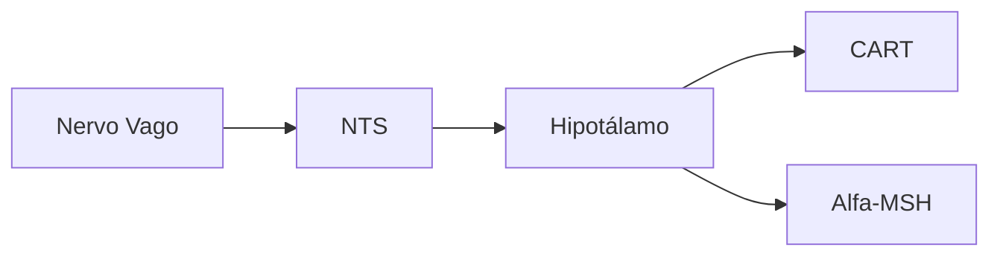

# Controle da Fome
Do que temos fome?
Ao longo da evolução, a necessidade primária de sentirmos fome é para saciarmos nossas necessidades nutricionais. Mas há outros fatores que regulam a fome de acordo com nosso ciclo circadiano e vontades. Dessa forma, podemos separar nossa fome em Fome Homeostática e Fome Hedônica.

## Reguladores Fisiológicos
**Leptina** é o principal regulador do apetite a longo prazo. Esse hormônio é produzido nas células adiposas e promovem a saciedade. Mas, pessoas obesas tendem a ter uma resistência no receptor, diminuindo o efeito de saciedade.
Além da leptina, há sinalizações de curto prazo promovidos por sistemas neurais e endócrinos. Os neurais envolvem vias **SNA do nervo vago**. os Hormonais envolvem:
- [[Grelina]]
- [[Colecistocinina|CCK]]
- [[PYY]]
- [[GLP-1]] (Peptídeo semelhante ao glucagon-1)
- [[Oxitomodulina]]
- [[Insulina]]

### Sistema Nervoso
Com estudos, percebeu-se que existe um centro principal da fome e da saciedade, o [[Núcleo Arqueado]]. Esse núcleo pode estimular ou inibir outros dois núcleos hipotalâmicos como o [[Núcleo Paraventricular]], que promove sinais anorexígenos, e [[[Hipotálamo Lateral]], que promovem sinais orexígenos. Por fim, esses dois núcleos enviam sinais para o [[Núcleo do Trato Solitário]] no tronco mesencefálico regulando a vontade de ingestão de comida.
#### Núcleo Arqueado
Possui neurotransmissores envolvidos são os NPY e AgRP como orexigênico e os POMC e CART como anorexigênico.
#### Núcleo Paraventricular
Responsável por sinalizar ao NTS com sinal anorexigênico.
#### Hipotálamo Lateral
Responsável por sinalizar ao NTS com sinal orexigênico.

## Jejum
### Grelina
Atua estimulando as vias anorexígena

## Pós-Prandial
- Sinalizadores de curto prazo
- Morilidade e pressão intestinal
- Nervo Vago =>NTS => Hipotálamo => CART e Alfa-MSH (anorexígenos)
- Saciedade

### CCK (colecistocinina)
- Sinalizador endócrino de curto prazo
- Intestino delgado
- Estimulado por gordura

## Obesidade
Normalmente, o corpo consegue e autorregular de forma que não comemos mais do que o necessário, sentindo saciedade com o crescimento dos adipócitos pela leptina. Contudo, As células adiposas produzem inúmeros hormônios, e quando crescem as produzem muito mais que o normal, inclusive a resistina que promove aumento a resistência do receptor de leptina. Assim, o controle de saciedade se encontra desbalanceado.

### Problemas da obesidade
Pela grande liberação de hormônios lixo, há um aumento de quadro inflamatório, promovendo fatores de risco para o indivíduo.