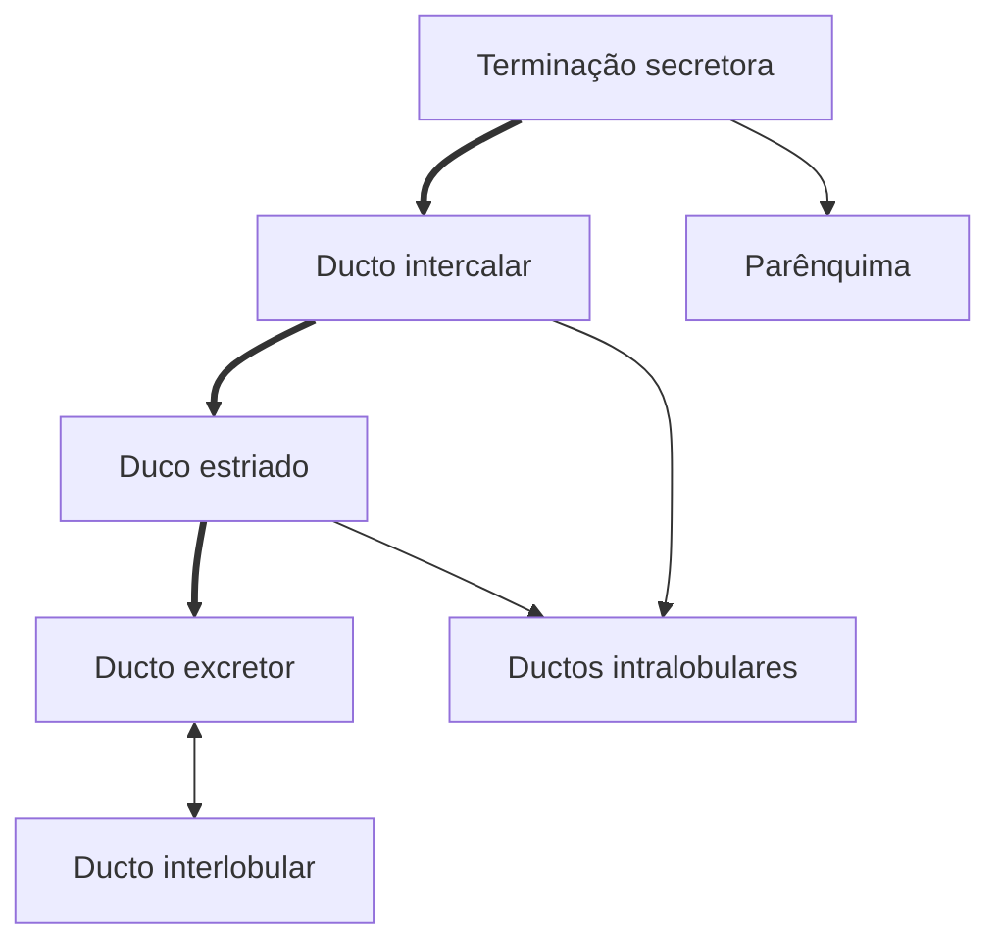

# Cavidade Bucal
A muscosa bucal é classificada de 3 formas:
- Revestimento
	- Lábio, bochecha e assoalho da boca
- Mastigatória
	- Palato duro e gengiva
- Especializada
	- Dorso da língua e botões gustativos

Possui glândulas maiores e menores

## Lábios
![[Lábio (Lâmina).png]]
Na região de pele, transição e de mucosa dos lábios, o epitélio é estratificado pavimentoso
- Na região de pele e transição é queratinizado
- Na região de mucosa não.

### Pele
Possui folículo piloso e glândulas sebáceas, além de possuir queratina

### Transição
Não possui o folículo piloso, possui papilas mais proeminentes

### Mucosa
Não possui as glândulas, nem folículo piloso, nem queratina, apenas o epitélio estratificado mais grosso.

# Língua
A língua possui diversas papilas.
- No corpo dorsal da língua encontra-se as papilas fungiformes e filiformes
- As circunvaladas encontram-se na divisão do corpo com a raíz
- Existem Botões gustativos nas papilas
	- Poro gustativo
	- Células gustativas

## Papilas
### Filiformes
Uma papila com ápice fino e base larga, possuindo queratina no ápice.
Não possui botão gustativo.

### Fungiforme
Possui forma de fungo, com ápice boleado e base mais estreita. Possui botão gustativo próximo ao ápice.

### Valada (Circunvalada)
Possui uma [[Glândula de Von Ebner]] no conjuntivo

## Botão Gustativo
![[Botão Gustativo.png]] ![[Botão Gustativo (Lâmina).png]]
Possuem:
- Células basais
- Célula gustativa
	- São células nervosas.
	- São mais claras (mas na lamina não tem como diferenciar)
- Célula suporte

# Glândulas Salivares
São glândulas exócrinas acinosas com porção secretora e porção condutora formando uma espécie de cacho de uva (adenômeros).
- Os ductos possuem as partes intralobulares, interlobulares

Os ácinos mucosos possuem muito muco (cora pouco) e tem núcleos periféricos e pavimentosos

Os ácinos serosos é muito eosinófilo com núcleo esférico

## Parênquima
- Células Mucosas
	- secretam muco composto de glicoproteínas (mucinas librificantes)
- Células Serosas
	- Secretam
- 

## Sistema de Ductos

## Glândula sublingual
São mistas, sendo acinosas e mucosas