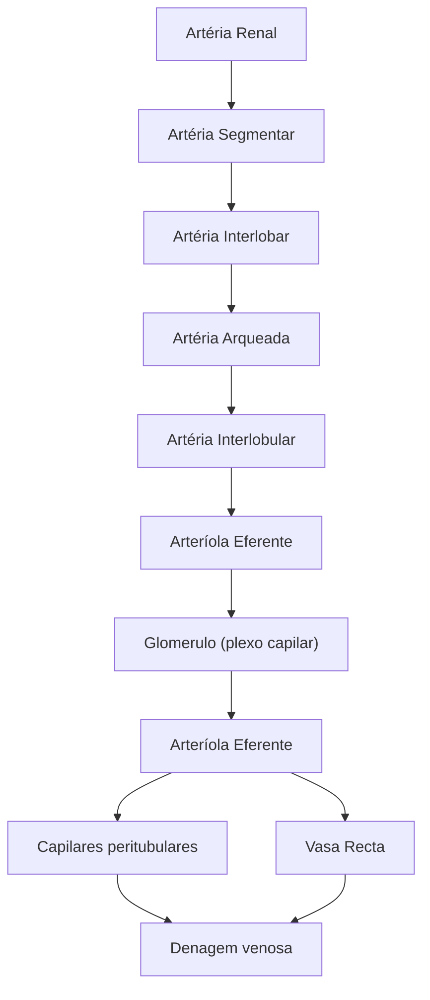
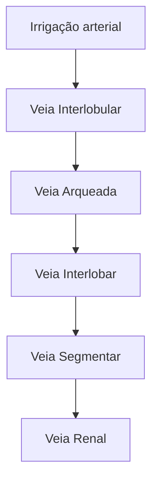

O sangue no rim possui uma região arteriolar, que irá se ramificar até adentrar os glomerulos e uma parte venosa de saída, que segue a mesma nomenclatura que as artérias.
![[Vasos Renais.png]]
# Parte Arteriolar

### Artéria Renal

### Artéria Segmentar

### Artéria Interlobar

### Artéria Arqueada

### Artéria Interlobular

### Arteríola Aferente

### Plexo Capilar (glomérulo)

### Arteríola Eferente

### Capilares Peritubulares

### *Vasa Recta*

# Parte Venosa
